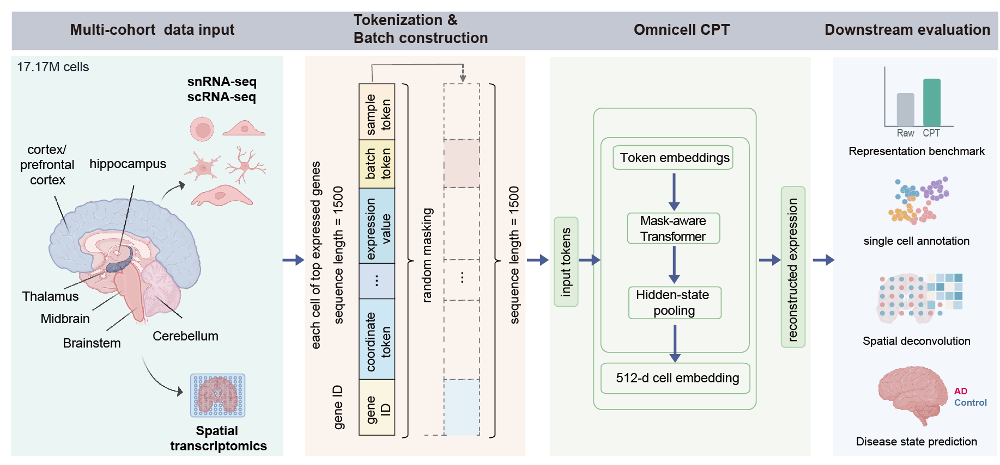

# OmniCell-CPT-HumanBrain



OmniCell-CPT-HumanBrain is a continual-pretraining and evaluation framework for human brain transcriptomic representation learning. It harmonizes 17,169,400 public human brain profiles, including 11,496,206 single-cell or single-nucleus profiles and 5,673,194 spatially resolved entries, into a unified sparse memmap resource for OmniCell-CPT training and downstream analysis.

The reported Brain Informatics analyses evaluate whether one representation can support human brain atlas organization, section-disjoint cell annotation, spatial cell annotation and sample-level Alzheimer's disease (AD) state modeling. OmniCell-CPT-HumanBrain achieved strong held-out annotation performance across human single-cell/single-nucleus and spatial benchmarks. In the balanced all44 human brain cohort, sample-level AD-associated state modeling reached AUROC 0.893 with OmniCell-CPT latent summaries, compared with 0.731 for raw gene SVD under leave-one-sample-out evaluation.

This repository releases the code used for four linked tasks:

1. Convert and run OmniCell checkpoints through a Hugging Face-style interface.
2. Continue pretraining OmniCell-CPT on human brain CSR memmap single-cell, single-nucleus and spatial transcriptomics data.
3. Evaluate learned representations against raw-expression and external foundation-model baselines under held-out designs.
4. Run downstream brain evaluation, including cell annotation, spatial annotation and sample-level AD/control disease-state prediction.

Large datasets, checkpoints, generated figures, and internal result folders are intentionally not committed.

## Repository Layout

| Path | Purpose |
| --- | --- |
| `omnicell_hf/` | Hugging Face-style OmniCell model, processor, H5AD tokenizer, and checkpoint-loading API. |
| `scripts/` | Generic checkpoint conversion, H5AD embedding, H5AD fine-tuning, and memmap continual pretraining commands. |
| `training/` | Continual pretraining, multitask fine-tuning, checkpoint selection, and validation-embedding entry points. |
| `evaluation/atlas/` | Brain cell index construction, OmniCell embedding, and representation metric validation. |
| `evaluation/spatial/` | Spatial deconvolution, selected-chip benchmarks, and external baseline comparisons. |
| `evaluation/ad_readout/` | Sample-level AD/control representation probes and interpretable multicell feature analyses. |

## Quick Start

```bash
export PYTHONPATH="$PWD:${PYTHONPATH}"

python scripts/convert_legacy_checkpoint.py   --legacy-checkpoint-dir /path/to/legacy/checkpoint   --output-dir outputs/OmniCell_backbone_hf   --model-type backbone

python scripts/embed_h5ad.py   --h5ad /path/to/sample.h5ad   --output-h5ad outputs/sample_with_omnicell.h5ad   --mode spatial   --n-cells-per-sample 10

python scripts/train_memmap_pretrain.py   --manifest /path/to/dataset_manifest.json   --output-dir outputs/nvu_continual_pretrain   --legacy-checkpoint-dir /path/to/legacy/checkpoint   --token-per-cell 500
```

## Main Workflows

### Continual Pretraining

Use `scripts/train_memmap_pretrain.py` for generic OmniCell-CPT continual pretraining. The multitask fine-tuning scripts in `training/` add anchor tables, disease/age labels, adversarial balancing, and checkpoint Pareto selection used for representation audits.

### Representation Evaluation

Use `evaluation/atlas/validate_atlas.py` to compare OmniCell-CPT embeddings with raw-expression SVD/PCA transformations. These scripts expect metadata and embedding arrays generated by the training or embedding workflows.

### Spatial Benchmarks

Use the scripts in `evaluation/spatial/` to build selected-chip tasks, compare OmniCell-CPT against external foundation-model features, and run vascular deconvolution validation. External methods such as Tangram, GraphST, scGPT, scFoundation, CellPLM, or NicheFormer require their own installations and model assets.

### AD Readout and Interpretability

Use `evaluation/ad_readout/run_multicell_integrated_ad_model.py` for sample-level AD/control modeling. The safest manuscript claim is that sample-level multicell aggregation separates AD from Control under grouped validation and that the disease axis can be interpreted through glial, vascular, mural, neuronal, ligand-receptor, region, and gene-module features.

## Environment

Core Python dependencies include `torch`, `transformers`, `safetensors`, `numpy`, `pandas`, `scipy`, `scikit-learn`, `anndata`, `matplotlib`, and `scanpy`. FlashAttention is recommended for full OmniCell forward passes where supported by the hardware and CUDA stack.

```bash
pip install -e .
```

Memmap pretraining scripts require the `cellfm_dataset` reader package to be installed or available on `PYTHONPATH`.

Some benchmark scripts have optional dependencies. Install them only for the relevant baseline:

- Tangram: `tangram-sc`
- GraphST: GraphST source checkout and its environment
- scGPT / scFoundation / CellPLM / NicheFormer: the corresponding model package and pretrained weights
- UMAP panels: `umap-learn`

## Data Policy

This repository contains code and the OmniCell vocabulary asset only. It does not include protected or very large raw data, generated memmaps, model checkpoints, embedding arrays, or publication figures. Paths in scripts should be supplied through command-line arguments or environment variables.

## Citation

Please cite the associated OmniCell-CPT-HumanBrain manuscript when using this code. A formal citation block can be added here after publication.
